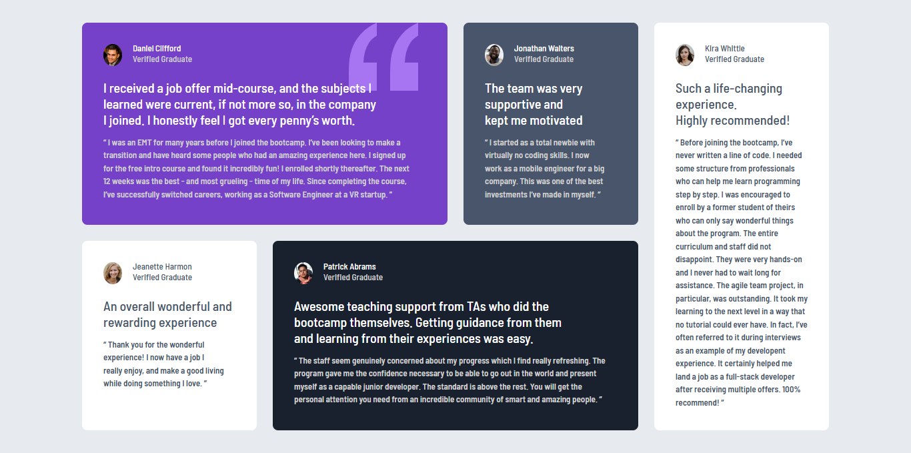

# Testimonial Grid Section Challenge By Prisca-K

This is a solution to the [Testimonial Grid on Frontend Mentor](https://www.frontendmentor.io/challenges/testimonials-grid-section-Nnw6J7Un7).

### The challenge

Users should be able to:

- Bbuild out this testimonials grid section and get it looking as close to the design as possible

### Screenshot

### Links

- Solution URL: [My FEM Solution](https://www.frontendmentor.io/challenges/testimonial-grid-RMydElrlOj?tab=solutions)
- Live Site URL: [My Testimonial Grid Challenge](https://testimonial-grid-fem.vercel.app/)

### Built with

- Semantic HTML5 markup
- CSS custom properties
- Flexbox
- CSS Grid
- SASS
- VITE

## Author

- Frontend Mentor - [@Prisca-K](https://www.frontendmentor.io/profile/Prisca-K)
